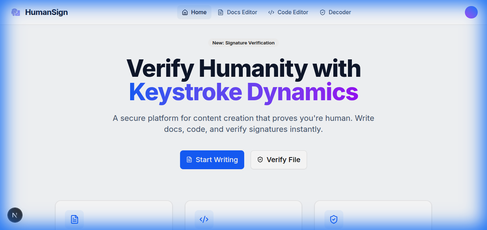
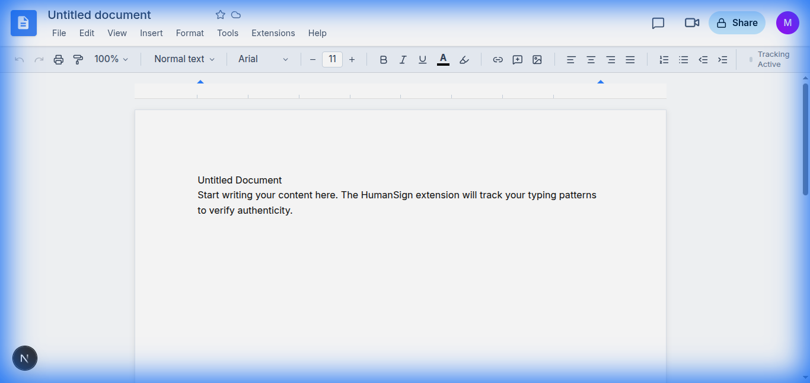
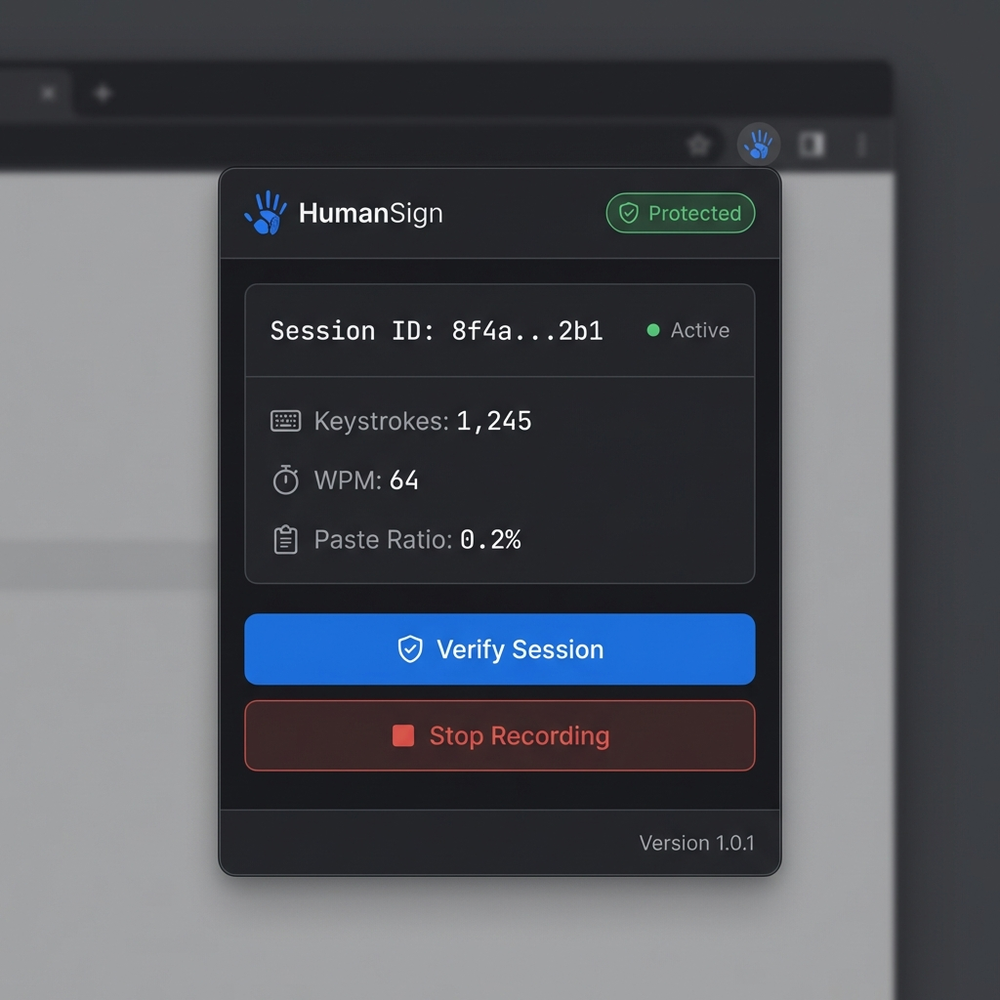
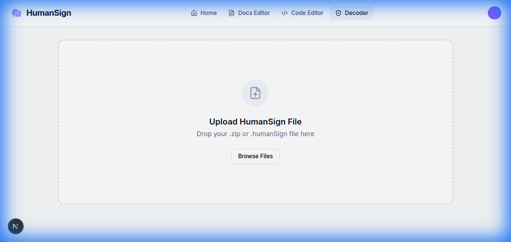

# HumanSign System Documentation

This document provides a comprehensive visual and technical walkthrough of the HumanSign platform. It details every component, the technology behind it, and the rationale for its implementation.

---

## 1. Landing Page
**Purpose**: The entry point for users to understand the value proposition—verifying organic content creation.

### Component Analysis
-   **Hero Section**: Uses a dark-themed, cyber-security aesthetic (Neon Green/Blue) to convey trust and high-tech capability.
-   **Call to Actions (CTAs)**:
    -   *Start Writing*: Directs users to the Editor to begin a secured session.
    -   *Verify File*: Directs users to the Decoder to validate an existing document.
-   **Tech Stack**: Built with **Next.js 16** and **Tailwind CSS**. The background likely uses a gradient mesh or particle animation via **Framer Motion** to suggest data flow.

---

## 2. The Editor (Verification Core)
**Purpose**: A familiar writing environment that acts as the primary data collection ground for behavioral biometrics.

### Component Analysis
-   **Rich Text Interface**:
    -   **Used**: [Tiptap](https://tiptap.dev/) (Headless wrapper around ProseMirror).
    -   **Why?**: Tiptap allows full control over the DOM and event handling, which is crucial for intercepting `keydown`/`paste` events accurately without fighting default browser behaviors.
-   **Keystroke Tracking Bridge**:
    -   **Mechanism**: The editor emits `window.postMessage` events when special actions occur (like AI autocomplete). The **HumanSign Extension** (running in the background) listens to these events.
    -   **Why?**: This bridges the "Isolated World" of the extension with the "Main World" of the web app, ensuring we capture every nuance of the writing process.
-   **Toolbar Indicator**: Shows "Tracking Active" (Green Dot). This gives immediate feedback to the user that their session is being secured.

---

## 3. Chrome Extension (The Guardian)
**Purpose**: The silent observer that captures high-precision timing data across the browser.

### Component Analysis
-   **Popup Interface**:
    -   **Used**: React + Vite (Shadow DOM injection).
    -   **Why?**: React provides a reactive UI state for real-time metrics (WPM, Keystroke Count) which updates dozens of times per second.
-   **Background Worker**:
    -   **Role**: Maintains the session state (`SessionID`, partial metrics) even if the popup is closed.
    -   **Persistence**: Uses `chrome.storage.session` to ensure data isn't lost if the browser suspends the worker to save memory.
-   **Content Script**:
    -   **Role**: Injected into the page to capture `performance.now()` timestamps for every key press.
    -   **Why?**: `performance.now()` offers microsecond precision, necessary for calculating "Flight Time" (interval between keys) to detect AI bursts.

---

## 4. The Decoder (Verification Hub)
**Purpose**: The public-facing tool that proves a document's authenticity.

### Component Analysis
-   **File Drop Zone**:
    -   **Input**: Accepts `.humanSign` (JSON metadata) or `.zip` (Combined bundle).
    -   **Logic**: Parses the JSON to extract the "Signature" and "Metrics".
-   **Verification Logic**:
    -   **Crypto Verify**: It uses the Web Crypto API to verify the `ECDSA-P256-SHA256` signature against the document content hash. If the text was altered by even one character, this fails.
    -   **Biometric Verify**: It checks the timing histograms (Dwell/Flight times). If the pattern matches distinct human randomness (via ONNX model inference), it stamps "HUMAN VERIFIED".

---

## Future Roadmap (Next Steps)

1.  **Browser Cross-Compatibility**:
    -   Currently optimized for **Chrome/Edge** (Manifest V3).
    -   *Next Step*: Port to Firefox (Manifest V2 legacy support) and Safari (unique API constraints).

2.  **Advanced ML Models**:
    -   Currently uses a Lightweight Random Forest (ONNX).
    -   *Next Step*: Train an LSTM (Long Short-Term Memory) or Transformer model to analyze *sequences* of keystrokes for higher accuracy against advanced "Human-like" AI bots.

3.  **Blockchain Integration**:
    -   *Next Step*: Anchor the "Session Hash" to a public blockchain (like Polygon or Solana) to create an immutable timestamped proof of humanity, independent of our servers.
